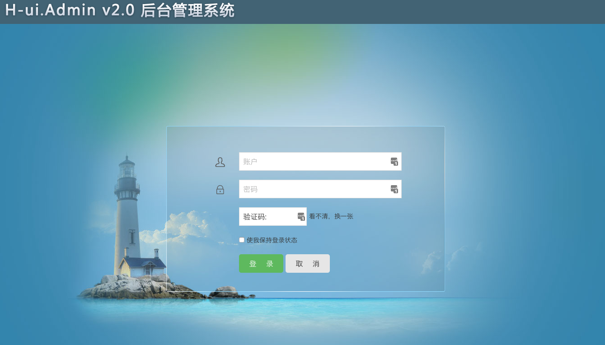
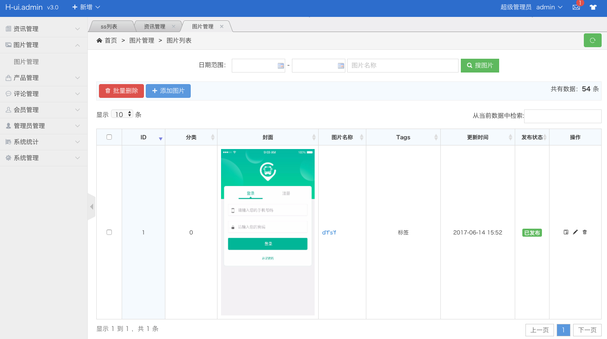

# djangorestful_hui
djangorestful结合hui框架搭建后台管理系统和后台接口

# 执行顺序

虚拟环境
virtualenv env

激活环境
. env/bin/activate

安装包
pip install -r requirements.txt

进入目录
cd tutorial

启动服务
python manage.py runserver

后台系统
http://127.0.0.1:8000/index

后台接口
http://127.0.0.1:8000/api/

退出虚拟环境
deactivate

